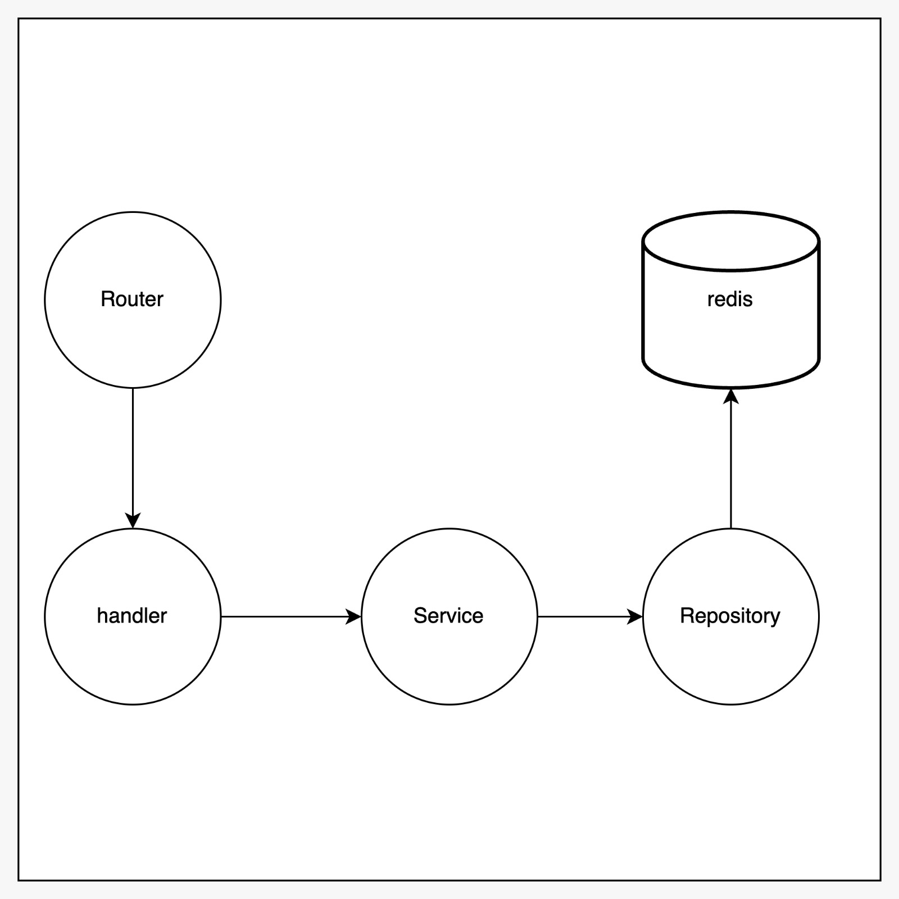

# Weather API

### Requirement:
##### 1. Docker
##### 2. Redis & go-redis
##### 3. Chi
##### 4. godotenv
##### 5. weather api (https://www.weatherapi.com/)
##### 6. open weather map (https://openweathermap.org//)


### Installation :
##### 1. Manual :
```sh
go mod tidy && go mod vendor -v
```
##### 2. Docker-compose :
```sh
docker-compose up -d
```

### Response
base url = http://localhost:8080/api/v1
##### 1. Get /weathers?city=jakarta
```json
{
  "message": "Weather fetched successfully",
  "success": true,
  "status": "OK",
  "data": {
    "weather": {
      "city": "Jakarta",
      "temperature": 27,
      "humidity": 74,
      "condition": "few clouds",
      "source": "OpenWeatherMap",
      "cached": true,
      "Local_time": "2025-01-03T00:12:43+07:00"
    }
  }
}
```
##### 2. Get /stats
```json
{
    "message": "Stats fetched successfully",
    "success": true,
    "status": "OK",
    "data": {
        "api_usage": 1,
        "cache_hits": 0
    }
}
```

### Documentation Diagram:
1. Architecture
